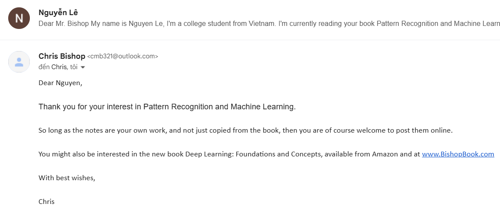

Hi 🙌, mình là [Lê Nguyễn](https://www.linkedin.com/in/le-nguyen-0929a42a2/), một sinh viên (gà) năm cuối tại Trường Đại học Khoa học tự nhiên - VNUHCM. Mục đích của trang web này là trở thành một công cụ để có thể giúp các bạn đọc cuốn [Pattern Recognition and Machine Learning](https://www.microsoft.com/en-us/research/uploads/prod/2006/01/Bishop-Pattern-Recognition-and-Machine-Learning-2006.pdf) của Christopher Bishop một cách dễ thở hơn. 

Vì mình cũng ngồi đọc (gần hết) cuốn này và có đôi lúc trở thành Chí Phèo chửi trời chửi đất vì không hiểu tác giả làm gì nên mình mới sinh ra cái của nợ này để giúp các bạn hiểu (một phần) tác giả đang làm gì (và không chửi trời chửi đất nữa). Mình mong là nó được đón nhận, à nếu thấy có gì sai thì cứ liên hệ với mình thông qua các mạng xã hội ở phía dưới nhé 😚 (kiến thức không để sai được, nhưng với kiến thức hạn hẹp của mình thì vẫn có thể sai thôi 😞).

Trước khi quyết định đưa cái này lên mạng thì mình đã được sự cho phép của tác giả (hehe). Và ngoài ra template của web này được copy từ [CS228-Note](https://ermongroup.github.io/cs228-notes/) (cái này cũng hay cực, recommended).

Ngoài ra, icon 🚧 nghĩa là đang viết, 💀 nghĩa là chưa viết và ✅ nghĩa là xong rồi hoặc là xong 1 phần 😗. Lưu ý nữa là, đây là note theo ý mình, thế nên có thể sai, các bạn nên sử dụng với mục đích tham khảo thêm 🥰.

## 1. Introduction

- 1.1 [Polynomial Curve Fitting](chapter1/polynomial_curve/) ✅
- 1.2 [Probability Theory](chapter1/prob_theory/)  ✅
    - 1.2.1 [Probability Densities](chapter1/prob_theory/density/) ✅
    - 1.2.2 [Expectations and Covariances](chapter1/prob_theory/expectation/) 🚧
    - 1.2.3 [Bayesian Probabilities]() 💀
    - 1.2.4 [Gaussian Distribution]() 💀
    - 1.2.5 [Curve Fitting Revisited]() 💀
    - 1.2.6 [Bayesian Curve Fitting]() 💀
- 1.3 [Model Selection]() 💀
- 1.4 [The Curse of Dimensionality]() 💀
- 1.5 [Decision Theory]() 💀
- 1.6 [Information Theory]() 💀
- [Exercises (Part I)](chapter1/prob_theory/exercises_1/) 🚧
- [Exercises (Part II)]() 💀

## 2. Probability Distributions 💀

- 2.1 [Binary Variables]()
- 2.2 [Multinomial Variables]()
- 2.3 [The Gaussian Distribution]()
- 2.4 [The Exponential Family]()
- 2.5 Nonparametric Methods (ta không cần đến thứ này đâu).

## 3. Linear Models for Regression 💀

## 4. Linear Models for Classification 💀

